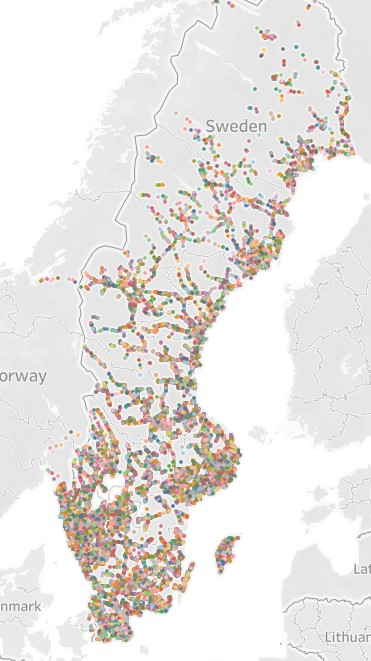

## Table of Contents

- [Introduction](#Introduction)
- [Contributing](#contributing)
- [Creator](#Creators)
- [References](#References)
- [Copyright and license](#Copyright-and-license)

### Introduction 
This repository contains the pipeline for Transfer Patterns Algorithm. Sweden's public transit network has been provided as a test case. The figure below shows the transit stop location.

The pipleline uses Spark Streaming Platform to model realtime environment.One-To-Many rTBTR algorithm has been used for preprocessing transfer patterns.  

### Contributing
We welcome all suggestions from the community. If you wish to contribute or report any bug please contact the creaters or create an issue on [issue tracking system](https://github.com/transnetlab/transit-routing/issues).

### Creator
- **Prateek Agarwal**
    - Ph.D. at Indian Institute of Science (IISc) Bengaluru, India.
    - Mail Id: prateeka@iisc.ac.in

### References

- [Bast, Hannah, et al. "Fast routing in very large public transportation networks using transfer patterns." European Symposium on Algorithms. Springer, Berlin, Heidelberg, 2010.](https://link.springer.com/chapter/10.1007/978-3-642-15775-2_25) 
- [Witt, S., 2015. Trip-based public transit routing. In Algorithms-ESA 2015 (pp. 1025-1036). Springer, Berlin, Heidelberg.](https://link.springer.com/chapter/10.1007/978-3-662-48350-3_85)
- [Agarwal, P., & Rambha, T., 2021. Scalable Algorithms for Bicriterion Trip-Based Transit Routing (_Under Review_).](https://arxiv.org/abs/2111.06654)

### Copyright and license
The content of this repository is bounded by MIT License. For more information see
[COPYING file](https://github.com/transnetlab/transit-routing/blob/main/LICENSE)
